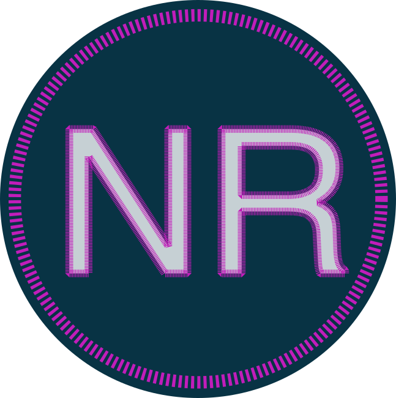

  

    
  

  

    
    
   
  

# Repo Search

Next-Repo is a [Next.js](https://nextjs.org/) project.  
The app displays GitHub Repo data and integrates search functionality.  
The aim of this project is to test drive the experimental Next.js 13.3 app router.

## Initial Phase

General steps include

- Create static/local data for the backend
- Build the Frontend (Layout, fetching of data, search, styling)

## Next Steps

- I'll update this readme as the app gets developed.

Cheers
